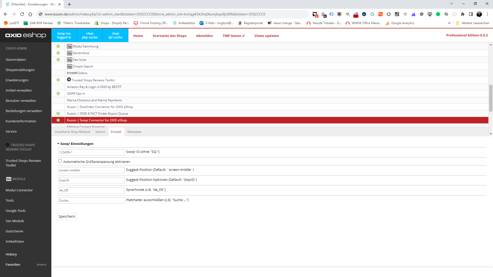

# Kussin | Sooqr Connector for OXID eShop

The module replaces OXID eShop search bar with a search bar from [Sooqr](https://www.sooqr.com/).
Basically it does the whole [Placing Sooqr on your website](https://sooqrsearch.atlassian.net/wiki/spaces/SSD/pages/2951381031/Sooqr+Search+implementation+guide?parentProduct=JSM-Portal&parentProductContentContainerId=10020&initialAllowedFeatures=disable-login-flow.disable-share&locale=en-US#Placing-Sooqr-on-your-website)
for you by [Using the Sooqr snippet](https://sooqrsearch.atlassian.net/wiki/spaces/SSD/pages/2951381031/Sooqr+Search+implementation+guide?parentProduct=JSM-Portal&parentProductContentContainerId=10020&initialAllowedFeatures=disable-login-flow.disable-share&locale=en-US#Using-the-Sooqr-snippet).

## Module Settings

### General Configuration

Basic settings of the extension including the module activation.

**The following configuration options are available:**

1. `account` - Sooqr ID
2. `setResizeFunction` - Suggest language code
3. `_setPosition` - Suggest Position (e.g. `screen-middle`)
4. `_setPositionOptions` - Suggest Position-Options (e.g. `{top:50, left: 20}`)
5. `_setLocale` - Suggest language code
6. `_excludePlaceholders` - Suggest exclude placeholders (e.g. `Search..`)

More details can be found in the [Sooqr Support portal](https://sooqrsearch.atlassian.net/servicedesk/customer/portals).

## Bugtracker and Feature Requests

Please use the [Github Issues](https://github.com/kussin/OxidSooqr/issues) for bug reports and feature requests.

## Support

Kussin | eCommerce und Online-Marketing GmbH 
Fahltskamp 3 
25421 Pinneberg 
Germany

Fon: +49 (4101) 85868 - 0 
Email: info@kussin.de

## Copyright

&copy; 2006-2023 Kussin | eCommerce und Online-Marketing GmbH